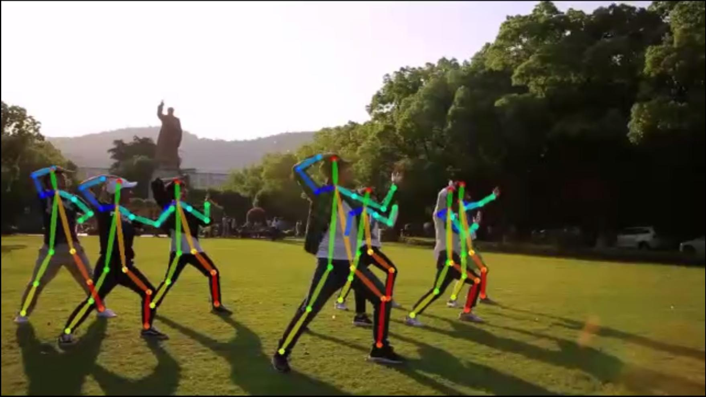
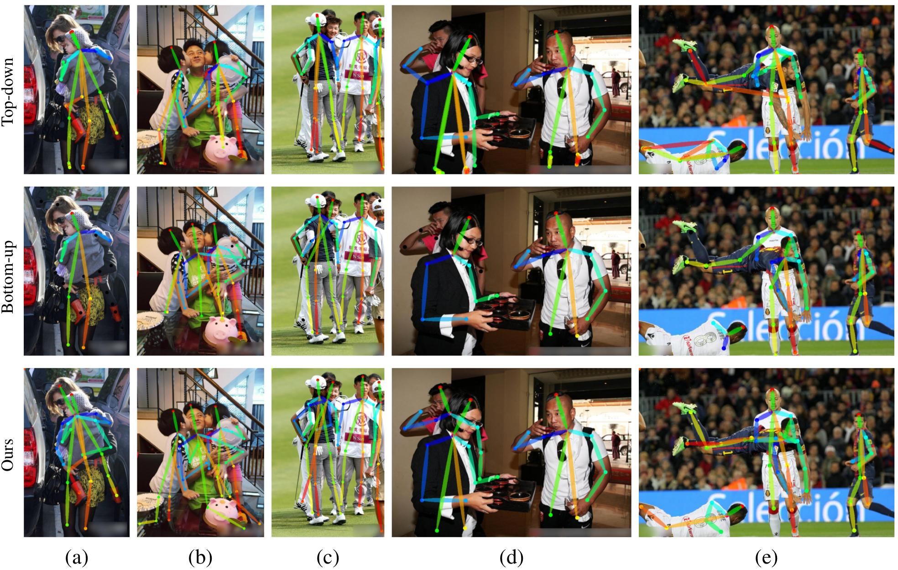

# Multi-person Pose Estimation
Miaopeng Li, Zimeng Zhou, Jie Li, Xinguo Liu, "Bottom-up Pose Estimation of Multiple Person with Bounding Box Constraint", ICPR2018

## Introduction

We propose a new method for multi-person pose estimation which combines the traditional bottom-up and the top-down methods. Specifically, we perform the network feed-forwarding in a bottom-up manner, and then parse the poses with bounding box constraints in a top-down manner. At the training stage, the network is trained to learn the keypoints of all persons indiscriminately. At the testing stage, we perform the network feed-forwarding for the whole image only once, then parse and refine the pose of each person within their bounding boxes. The bounding box constraint narrows down the scope of possible connections and avoids mistake propagation across the poses of different persons.

## Demo

You can click the images below to watch our video demo for a vivid and intuitive visualization of results.

    

## Discussion

The main idea of this work is using a residual network to learn both the confidence maps of joints and the connection relationships between joints, and then take advantage of the body bounding box to parse the pose. Figure 1 shows some comparison result between ours, the top-down method by [Wei et al.](https://github.com/shihenw/convolutional-pose-machines-release) and the bottom-up method by [Cao et al.](https://github.com/ZheC/Realtime_Multi-Person_Pose_Estimation). In contrast to the top-down method, firstly, as shown in Figure 1(a-b), our method is more robust to the shift and the tightness of the body bounding boxes. Secondly, when two people are very close, as shown in Figure 1(c-d), the single-person pose estimator fails to determine which person should be annotated, but our method works well. Thirdly, our method performs network feed-forwarding only once, yielding less inference time. In contrast to the bottom-up method, our method handles disconnected joints well, and is more robust to truncated or heavily occluded joints (Figure 1(a)(c-d)). Besides, our method effectively avoids mistake propagation across different poses (Figure 1(b-c)(e)).

#### Figure1: Pose estimation results comparison

    

## Citation
This work has been accepted by ICPR 2018 as oral presentation.

        @inproceedings{li2018bottom,
          title={Bottom-up Pose Estimation of Multiple Person with Bounding Box Constraint},
          author={Miaopeng Li, Zimeng Zhou, Jie Li, Xinguo Liu},
          booktitle={Pattern Recognition (ICPR), 2018 24th International Conference on},
           year={2018},
        }
